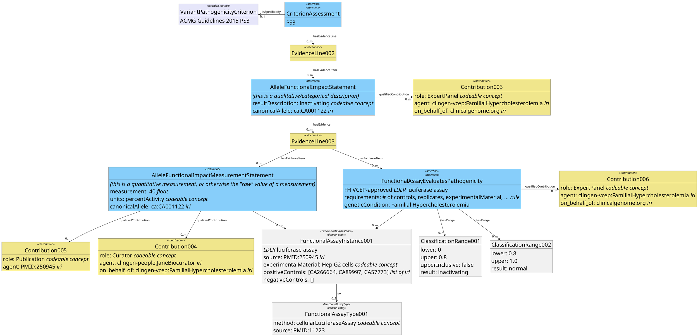

# Functional Data Assertion Model 0.1

## Data relevant to assertion of functional effect

The statement that a variant functionally alters a gene to lead to phenotype can be broken down into
a group of statments that together make this argument. The decision about the level of granularity at
which to model this may depend on practical matters such as what data are generally available, which
data may be used to make "metaassertions" about the data (like whether certain assay types are valid
for a particular disease), and considerations of how the data will be recorded and transmitted.

Underlying statements/data elements could include:
* The allele results in measureable change in function according to some assay.
  **(the measurement/classification itself)**
* The type of assay is relevant for assessing pathogenicity
  * The assay measures expression or function of gene product **(how assay relates to gene function)**
  * The specific alteration (e.g., lower expression, misfolding, reduced enzymatic activity)
    is known to cause the phenotype/disease **(DiseaseMechanism)**
  * Alteration of effect to a certain extent is associated with phenotype
    (this description may include the **units of measurement** and **threshold determination**)
  * Replication or combination of different assays may be required to meet evidence strength thresholds
* The particular instance of the assay performed is valid **(assay instance information)**
  * Positive and negative controls were used
  * An appropriate system (*in vitro*, model organism, cell line, etc.) was used

Provenance (which lab performed the assay, when it was performed, who abstracted results from a
manuscript) should also be recordable.

Separating out the "class" of an assay from its specific "instance" allows for more granular rules
for data processing or evaluation of whether evidence is being used appropriately in variant
interpretations.

## Separating the quantitative and qualitative results

## Some codeable concepts:
- Assay methods (likely from BAO/EFO):
  - protein expression by Western blot
  - Enzymatic activity by fluorescence
  - Gene expression by luciferase
  - Protein-protein interaction via PLA
- Experimental material:
  - cell line (e.g. HepG2, HEK, HeLa)
  - organism line (e.g. C57BL/6J, consider JAX lab nomenclature?)

## "Rules" for determining applicability of AssayInstance or AssayType

This is obviously an area for future expansion, and the experience we've had reviewing
the VCEP's decisions regarding functional data indicates that these are not currently
being developed or applied consistently across the groups, not including in 0.1 model.

## Translating between prior provisional model and this proposed model (data thesaurus):

| Current class          | Current term                           | New term(s)                                     |
|------------------------|--------------------------|----------------------------------------------|
| Allele_Functional_Impact | subject           | ?                                            |
|  | caid              | `AFImpactStatement`.canonicalAllele, `AFMeasurementStatement`.canonicalAllele |
|  | resultDescription | `AFImpactStatement`.label (inherited from `Entity`) |
|  | method            | `FunctionalAssayType`.method |
|  | material          | `FunctionalAssayInstance`.experimentalMaterial |
|  | effect            | `AFMeasurementStatement` (approx) |
|  | source            | ...depends on what the evidence the "Source" is for...  Is this redundant to `Contribution`?|
|  | contribution      | `Contribution` (0..n) |
| Source | origin | namespace of `Contribution`.agent |
|        | label  | `Contribution`.label (inherited from `Entity`) |
|        | extiri | `Contribution`.agent |
| Experiment_Effect | code | `AFImpactStatement`.resultDescription ? |
|  | label | `AFMeasurementStatement`.label (inherited from `Entity`) |
|  | description | `AFMeasurementStatement`.description (inherited from `Entity`) |
|  | scale | ? |
|  | direction | ? |
|  | size | ? |
|  | comment | ? |
| Experiment_Material | code | `FunctionalAssayInstance`.experimentalMaterial.code |
|  | label | `FunctionalAssayInstance`.experimentalMaterial.label | 
|  | description | `FunctionalAssayInstace`.experimentalMaterial. description |
|  | originTissue | ? |
|  | originSpecies | ? |
|  | assayPreparation | ? |
|  | subjectPhenotype | ? |
|  | subjectGenotype  | ? | 

Comments:
- Is the `AlleleFunctionalImpactStatement` different enough from `CriterionAssessment` to
  warrent its own level on this diagram (as opposed to being a specialization of
  `CriterionAssessment`?)
- CAid will map to multiple places
- 'label' and 'description' are available on all Entities in the VI model.
- What is the difference between "source" and "contribution" in the provisional GenKB model?
- Experiment_Effect most closely maps to AlleleFunctionalMeasurementStatement, but maybe with
  elements of AlleleFunctionalImpactStatement. Suggest "measurement" and "units" (possibly with
  "categories" as a mutually-exclusive attribute to "units") rather than combination of
  "scale", "direction", "size"
- Model for experimentalMaterial requires additional work...
- How would "subjectPhenotype" and "subjectGenotype" be used in the Experimental_Material?